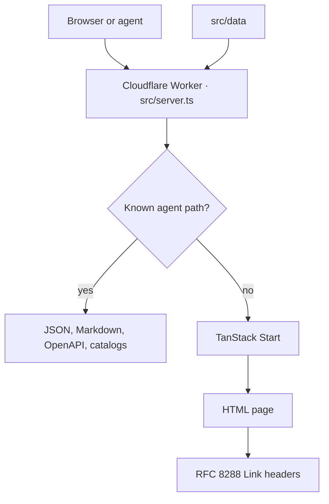

<p align="center">
  <a href="https://debeshghorui.dev">
    
  </a>
</p>

<p align="center">
  A personal portfolio that a person can browse and an agent can quote.
</p>

<p align="center">
  <a href="https://debeshghorui.dev">debeshghorui.dev</a>
  ·
  <a href="https://github.com/debeshghorui">GitHub</a>
  ·
  <a href="mailto:hello@debeshghorui.dev">hello@debeshghorui.dev</a>
</p>

<p align="center">
  
  
  
  
  
</p>

---

The homepage is the public record: projects, stack, current study, and how to get in touch. The same record is also a small HTTP API, a Markdown alternate, an OpenAPI document, and a set of browser tools. Change a sentence in `src/data` and every surface picks it up.

Live site: **[debeshghorui.dev](https://debeshghorui.dev)**

```bash
curl https://debeshghorui.dev/api/portfolio.json
curl -H "Accept: text/markdown" https://debeshghorui.dev/
```

## What you get

| Surface | What it is |
| --- | --- |
| Homepage | Hero, activity grid, projects, stack, timeline, contact. Light and dark, remembered in the browser. |
| Pages | About, contact, privacy, and a short API note for developers. |
| JSON API | Read-only profile, projects, stack, timeline, and contact. No key. |
| Markdown | `Accept: text/markdown` on `/`, or `GET /index.md`. Token count in `x-markdown-tokens`. |
| Discovery | Link headers, `llms.txt`, an RFC 9727 API catalog, an agent-skills index, and an AI catalog. |
| WebMCP | In-page tools so a browser agent can read the portfolio and jump to a section. |

## How a request moves



Agent routes are answered before the app renders. Everything else goes through TanStack Start. The homepage response also advertises the catalogs, the OpenAPI file, and the Markdown alternate.

## Pages

| URL | File |
| --- | --- |
| `/` | `src/routes/index.tsx` |
| `/about` | `src/routes/about.tsx` |
| `/contact` | `src/routes/contact.tsx` |
| `/developers` | `src/routes/developers.tsx` |
| `/privacy` | `src/routes/privacy.tsx` |
| `/robots.txt` | `src/routes/robots[.]txt.ts` |
| `/sitemap.xml` | `src/routes/sitemap[.]xml.ts` |

Routes are files. `src/routes/__root.tsx` is the shell around every page. `src/routeTree.gen.ts` is generated. See `src/routes/README.md` for the file-routing rules.

## For agents

The site is public and read-only. Errors under the API and under `/.well-known` use `application/problem+json` with a stable `code` and a `resolution`. Unknown API paths and unknown `/.well-known` paths return 404. Anything other than `GET` or `HEAD` on a known route returns 405.

| Method | Path | Returns |
| --- | --- | --- |
| GET | `/api/portfolio.json` | Profile, projects, stack, timeline, contact |
| GET | `/api/health` | `{ "status": "ok" }` |
| GET | `/openapi.json` | OpenAPI 3.1 description of the API |
| GET | `/index.md` | Homepage as Markdown |
| GET | `/llms.txt` | Short index of what to read, and when |
| GET | `/llms-full.txt` | Full homepage Markdown |
| GET | `/.well-known/api-catalog` | RFC 9727 linkset |
| GET | `/.well-known/ai-catalog.json` | AI catalog |
| GET | `/.well-known/agent-skills/index.json` | Skills discovery index |
| GET | `/.well-known/agent-skills/debesh-portfolio/SKILL.md` | How to read this portfolio |

`robots.txt` allows crawling and sets `Content-Signal: search=yes, ai-input=yes, ai-train=yes`, with a sitemap and an Agentmap.

On page load the site registers WebMCP tools: `get_profile`, `list_projects`, `get_tech_stack`, `get_timeline`, `get_contact_info`, `navigate_to_section`, and `set_theme`.

## Edit the site

Copy lives in `src/data`. Components read those modules. The JSON API and the Markdown renderer read them too.

| Change | File |
| --- | --- |
| Name, URL, handle, email | `src/data/site/index.ts` |
| Titles and descriptions | `src/data/meta/index.ts` |
| Greeting, tagline, bio | `src/data/profile/index.ts` |
| Projects | `src/data/projects/index.ts` |
| Tools on the stack row | `src/data/stack/index.ts` |
| Current study | `src/data/timeline/index.ts` |
| Social profiles | `src/data/links/index.ts`, `src/data/socials/index.ts` |
| Contact copy | `src/data/contact/index.ts` |
| Section titles | `src/data/sections/index.ts` |
| Nav labels | `src/data/nav/index.ts` |

Portrait: `src/assets/image.webp`.

## Run it locally

[Bun](https://bun.sh) is the package manager (`bun.lock`, `bunfig.toml`).

```bash
bun install
bun run dev
```

The dev server listens on [http://localhost:3000](http://localhost:3000).

```bash
bun run build     # production build (Nitro, Cloudflare Workers preset)
bun run preview   # preview the production build
bun run lint      # eslint
bun run format    # prettier on ts/tsx
```

Production runs as a Cloudflare Worker. Nitro is configured with the `cloudflare-module` preset in `vite.config.ts`.

## Layout

```text
src/
  routes/          file routes and the app shell
  data/            the portfolio, in one place
  components/      homepage sections, theme toggle, shadcn/ui
  agent/           markdown, OpenAPI, catalogs, skills, request router
  server.ts        Worker entry: agent routes, then SSR
  styles.css       Tailwind and theme tokens
```

Theme preference stays in `localStorage` on the visitor’s machine. There are no accounts, no contact-form store, and no extra analytics script.

## Stack

[TanStack Start](https://tanstack.com/start) and [TanStack Router](https://tanstack.com/router) on [Vite](https://vite.dev), [React 19](https://react.dev), [Tailwind CSS 4](https://tailwindcss.com), and [shadcn/ui](https://ui.shadcn.com). Deployed with [Nitro](https://nitro.build) on [Cloudflare Workers](https://developers.cloudflare.com/workers/).
