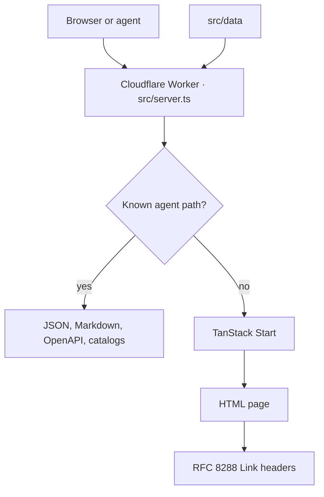

<p align="center">
  <a href="https://debeshghorui.dev">
    
  </a>
</p>

<p align="center">
  A personal portfolio a person can browse and an agent can quote.
</p>

<p align="center">
  <a href="https://debeshghorui.dev">Live site</a>
  ·
  <a href="https://debeshghorui.dev/api/portfolio.json">JSON</a>
  ·
  <a href="https://debeshghorui.dev/index.md">Markdown</a>
  ·
  <a href="https://github.com/debeshghorui">GitHub</a>
  ·
  <a href="mailto:hello@debeshghorui.dev">hello@debeshghorui.dev</a>
</p>

<p align="center">
  
  
  
  
  
</p>

---

**[debeshghorui.dev](https://debeshghorui.dev)** is the public record of Debesh Ghorui: projects, stack, a year of GitHub, current study, and how to get in touch. The sentences live once, in `src/data`. The Worker serves them as HTML, Markdown, JSON, OpenAPI, and a set of in-page tools. Change a line. Every surface follows.

```bash
curl https://debeshghorui.dev/api/portfolio.json
curl -H "Accept: text/markdown" https://debeshghorui.dev/
```

## A visit

A first visit opens on a word. The preloader cycles greetings — নমস্কার, नमस्ते, hello, bonjour, hola, ciao, こんにちは, 你好 — beside a progress count, then lifts away. It plays once a session. A script in the document head hides it before first paint when it has already played, or when the visitor prefers reduced motion.

The page is a single column, in this order:

| Section   | What it holds                                                                                                                                                                                                                                                  |
| --------- | -------------------------------------------------------------------------------------------------------------------------------------------------------------------------------------------------------------------------------------------------------------- |
| Hero      | Portrait, name, tagline, and a short bio. Badges say the short version: open source, India, CSE undergrad, batch of 2028. Social links sit beside the name. Each icon draws itself on hover.                                                                   |
| Stack     | Two rows of tools, drifting in opposite directions. A chip takes its brand color on hover and the row pauses while the pointer is over it. A plain list of the same names stays in the page for screen readers.                                                |
| Activity  | A year of GitHub, as a heatmap with a total, a legend, and a tooltip on each day. Cells follow the theme. The same component accepts a user or a repository.                                                                                                   |
| Projects  | [OIDC Server](https://github.com/debeshghorui/OIDC-Server), [Code Argus AI](https://github.com/debeshghorui/codeargus), ShipFlow AI, and [ChaiTailwind](https://github.com/debeshghorui/chaitailwind). Each card is a link, a status, a sentence, and a stack. |
| Currently | What the hours go to: generative AI, mobile, and web cohorts at ChaiCode.                                                                                                                                                                                      |
| Say hi    | A DM on X, an email, a button that copies the address, and a link to GitHub.                                                                                                                                                                                   |

Light and dark are both first-class. The choice is remembered in the browser and applied before first paint. The toggle wipes the page in a circle from the top right, using a view transition, and falls back to an instant switch when the browser has no view transitions or the visitor prefers reduced motion.

The footer closes the page in three columns: the site, the same socials, and the machine-readable files. A clock shows the local time in India and realigns to the minute. Back to top respects reduced motion. The name sits under the columns as a single oversized line.

Around the homepage: [about](https://debeshghorui.dev/about), [contact](https://debeshghorui.dev/contact), [privacy](https://debeshghorui.dev/privacy), and a short [API note](https://debeshghorui.dev/developers). A missing URL gets a quiet 404. A broken render gets a quiet 500.

The heatmap is fetched in the browser. A user comes from the public contributions API. A repository comes from GitHub commit activity. The written record stays the portfolio itself: profile, projects, stack, timeline, and contact.

## One record, every surface

| Surface   | What it is                                                                                   |
| --------- | -------------------------------------------------------------------------------------------- |
| Homepage  | The page above.                                                                              |
| JSON API  | Read-only profile, projects, stack, timeline, and contact. No key.                           |
| Markdown  | `Accept: text/markdown` on `/`, or `GET /index.md`. Token count in `x-markdown-tokens`.      |
| OpenAPI   | `GET /openapi.json`, OpenAPI 3.1, with an `operationId` on each operation.                   |
| Discovery | Link headers, `llms.txt`, an RFC 9727 API catalog, an agent-skills index, and an AI catalog. |
| WebMCP    | In-page tools so a browser agent can read the portfolio, jump to a section, or switch theme. |

Errors under `/api` and `/.well-known` use `application/problem+json` with a stable `code` and a `resolution`. Unknown API paths and unknown `/.well-known` paths return 404. Anything other than `GET` or `HEAD` on a known route returns 405.

## How a request moves



Agent routes are answered before the app renders. Everything else goes through TanStack Start. The homepage HTML also advertises the catalogs, the OpenAPI file, and the Markdown alternate.

## For agents

The site is public and read-only. `robots.txt` allows crawling and sets `Content-Signal: search=yes, ai-input=yes, ai-train=yes`, with a sitemap and an Agentmap.

| Method | Path                                                  | Returns                                     |
| ------ | ----------------------------------------------------- | ------------------------------------------- |
| GET    | `/api/portfolio.json`                                 | Profile, projects, stack, timeline, contact |
| GET    | `/api/health`                                         | `{ "status": "ok" }`                        |
| GET    | `/openapi.json`                                       | OpenAPI 3.1 description of the API          |
| GET    | `/index.md`                                           | Homepage as Markdown                        |
| GET    | `/llms.txt`                                           | Short index of what to read, and when       |
| GET    | `/llms-full.txt`                                      | Full homepage Markdown                      |
| GET    | `/.well-known/api-catalog`                            | RFC 9727 linkset                            |
| GET    | `/.well-known/ai-catalog.json`                        | AI catalog                                  |
| GET    | `/.well-known/agent-skills/index.json`                | Skills discovery index                      |
| GET    | `/.well-known/agent-skills/debesh-portfolio/SKILL.md` | How to read this portfolio                  |

On page load the site registers WebMCP tools: `get_profile`, `list_projects`, `get_tech_stack`, `get_timeline`, `get_contact_info`, `navigate_to_section`, and `set_theme`.

Use this site for Debesh's own background, projects, stack, studies, or public contact details. Call the JSON when you want structured data. Ask for Markdown when a prose summary is enough.

## Pages

| URL            | File                          |
| -------------- | ----------------------------- |
| `/`            | `src/routes/index.tsx`        |
| `/about`       | `src/routes/about.tsx`        |
| `/contact`     | `src/routes/contact.tsx`      |
| `/developers`  | `src/routes/developers.tsx`   |
| `/privacy`     | `src/routes/privacy.tsx`      |
| `/robots.txt`  | `src/routes/robots[.]txt.ts`  |
| `/sitemap.xml` | `src/routes/sitemap[.]xml.ts` |

Routes are files. `src/routes/__root.tsx` is the shell around every page: nav, theme, preloader, WebMCP, footer, and JSON-LD for the person. `src/routeTree.gen.ts` is generated. See `src/routes/README.md` for the file-routing rules.

## Edit the site

Copy lives in `src/data`. The page, the JSON API, the Markdown renderer, and the in-page tools all read those modules.

| Change                          | File                                                   |
| ------------------------------- | ------------------------------------------------------ |
| Name, URL, handle, email, clock | `src/data/site/index.ts`                               |
| Titles and descriptions         | `src/data/meta/index.ts`                               |
| Greeting, tagline, bio          | `src/data/profile/index.ts`                            |
| Projects                        | `src/data/projects/index.ts`                           |
| Tools on the marquee            | `src/data/stack/index.ts`                              |
| Current study                   | `src/data/timeline/index.ts`                           |
| Social profiles and hero badges | `src/data/links/index.ts`, `src/data/socials/index.ts` |
| Contact copy                    | `src/data/contact/index.ts`                            |
| Section titles                  | `src/data/sections/index.ts`                           |
| Nav and footer labels           | `src/data/nav/index.ts`                                |

Portrait: `src/assets/image.webp`.

The heatmap is `GitHubActivity` in `src/components/spaceui/github-activity.tsx`. Pass a username, `@handle`, `owner/repo`, or a GitHub URL. `shape` is `square`, `rounded`, or `circle`.

## Run it locally

[Bun](https://bun.sh) is the package manager (`bun.lock`, `bunfig.toml`).

```bash
bun install
bun run dev
```

The dev server listens on [http://localhost:3000](http://localhost:3000).

```bash
bun run build        # production build (Nitro, Cloudflare Workers preset)
bun run preview      # preview the production build
bun run lint         # eslint
bun run format       # prettier on ts/tsx
```

Production runs as a Cloudflare Worker. Nitro is configured with the `cloudflare-module` preset in `vite.config.ts`, with Worker logs and traces turned on.

## Layout

```text
src/
  routes/          file routes and the app shell
  data/            the portfolio, in one place
  components/      page sections, preloader, footer, theme, activity
  agent/           markdown, OpenAPI, catalogs, skills, request router
  server.ts        Worker entry: agent routes, then SSR
  styles.css       Tailwind and theme tokens
```

## What stays on the visitor's machine

Theme preference lives in `localStorage`. The preloader remembers that it already played, for the session. The clock is computed in the browser. There are no accounts, no contact-form store, and no extra analytics script. Cloudflare serves the Worker and sees the usual connection data for a public site. The privacy page says the same thing in full.

## Stack

[TanStack Start](https://tanstack.com/start) and [TanStack Router](https://tanstack.com/router) on [Vite](https://vite.dev), [React 19](https://react.dev), [Motion](https://motion.dev), [Tailwind CSS 4](https://tailwindcss.com), and [shadcn/ui](https://ui.shadcn.com). Type is set in Inter and JetBrains Mono, with Noto faces for the greetings. Deployed with [Nitro](https://nitro.build) on [Cloudflare Workers](https://developers.cloudflare.com/workers/).
